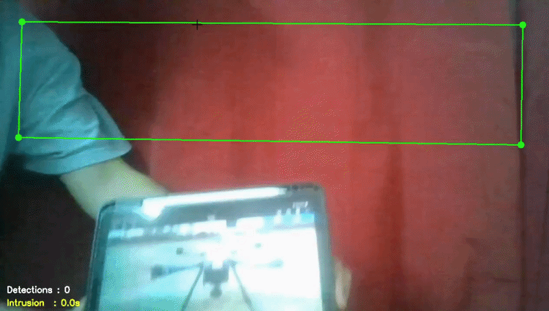

# 🛸 Drone Intrusion Detection System


A real-time computer vision system that detects drones in live video feeds and triggers automated alerts when an intruder enters a user-defined restricted zone. Built with a custom-trained YOLOv5 model and OpenCV.

---

## 📽 Demo

> Record a short screen capture using OBS or Windows Game Bar (Win + G) and drop it here as a GIF.  
> Tools: [ScreenToGif](https://www.screentogif.com/) (free, Windows)



---

## 🔍 Features

| Feature | Details |
|---|---|
| Real-time detection | YOLOv5 inference at 640px resolution on live webcam feed |
| Interactive restricted zone | Drag-and-drop quadrilateral drawn directly on the video feed |
| Timed intrusion alert | Configurable delay before an alert is triggered (default: 2s) |
| Evidence capture | Timestamped JPEG saved automatically on each confirmed intrusion |
| Structured event log | Per-session `.txt` log with confidence score, duration, and filename |
| Modular architecture | Clean separation into `detector`, `zone`, `logger`, and `visualizer` modules |
| YAML configuration | No hardcoded paths — all settings in `configs/config.yaml` |

---

## 🧠 Model Performance

| Metric | Result |
|---|---|
| Inference Speed | ~15.5 FPS on CPU |
| Average Confidence | ~90% on test images |
| Input Resolution | 640 × 640 px |
| Confidence Threshold | 0.50 |

The detector uses a **custom YOLOv5s model** fine-tuned on a drone dataset using the [Ultralytics YOLOv5](https://github.com/ultralytics/yolov5) framework.

> Trained weights (`best.pt`) are not included due to file size. You can train your own using the YOLOv5 training pipeline or reach out directly.

---

## 🏗 Architecture

```
drone-detection/
│
├── main.py                  # Entry point — wires all modules together
├── configs/
│   └── config.yaml          # All runtime settings (paths, thresholds, camera)
│
├── src/
│   ├── detector.py          # YOLOv5 wrapper — loads model, runs inference
│   ├── zone.py              # Restricted zone — mouse interaction & geometry
│   ├── logger.py            # Event logging & evidence image saving
│   └── visualizer.py        # All OpenCV drawing (boxes, HUD, warning banner)
│
├── weights/                 # Place your .pt model file here (git-ignored)
├── outputs/                 # Detection images & logs saved here (git-ignored)
└── assets/                  # Demo GIF and screenshots
```

---

## ⚙️ Setup

**1. Clone the repository**
```bash
git clone https://github.com/surya-singha/drone-detection.git
cd drone-detection
```

**2. Create and activate a virtual environment**
```bash
python -m venv venv
venv\Scripts\activate
```

**3. Install dependencies**
```bash
pip install -r requirements.txt
```

**4. Add your model weights**

Place your trained YOLOv5 `.pt` file in the `weights/` folder:
```
weights/best.pt
```

**5. Configure settings**

Edit `configs/config.yaml` to set your camera source, confidence threshold, and output directory. The defaults work out of the box for a standard webcam.

---

## 🚀 Usage

```bash
python main.py
```

Or specify a custom config:
```bash
python main.py --config configs/config.yaml
```

**Controls**

| Input | Action |
|---|---|
| Drag green corner handles | Reposition the restricted zone |
| `Q` | Quit |

---

## 📁 Output

Each session saves to `outputs/YYYY-MM-DD/`:

```
outputs/
└── 2024-11-01/
    ├── intrusion_2024-11-01_14-32-05.jpg
    ├── intrusion_2024-11-01_14-35-47.jpg
    └── event_log.txt
```

**Sample log entry:**
```
[2024-11-01_14-32-05]
Event:          Drone Intrusion
Confidence:     91.34%
Intrusion Time: 3.2s
Evidence:       intrusion_2024-11-01_14-32-05.jpg
----------------------------------------
```

---

## 🛠 Tech Stack

- **[PyTorch](https://pytorch.org/)** — deep learning backend
- **[YOLOv5](https://github.com/ultralytics/yolov5)** — real-time object detection
- **[OpenCV](https://opencv.org/)** — video capture and rendering
- **[Pillow](https://python-pillow.org/)** — image format conversion
- **[PyYAML](https://pyyaml.org/)** — configuration management

---

## 📄 License

This project is licensed under the MIT License.

---

## 👤 Author

**Surya Singha**  
B.Tech in Computer Science & Engineering — Vellore Institute of Technology  
[GitHub](https://github.com/surya-singha)

